# 정신건강 상담 도메인 특화 LLM 오판 완화 연구

Agent 수를 늘리며 **성능(Safety · Empathy · Faithfulness)** 과 **Latency** 의 trade-off를 측정하고, 위험할 때만 Revision을 거는 **Conditional Bidirectional** 구조로 최종 파이프라인을 고정한 연구용 실험 프레임워크입니다.

텍스트마이닝 · 팀 이지우 / 전도윤 / 이준희 / 윤연서

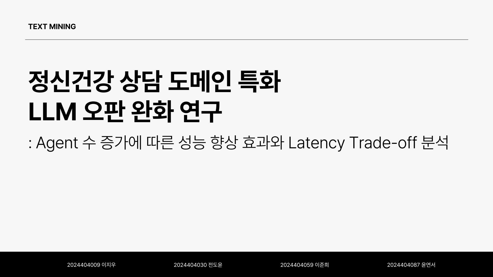

> **면책:** 본 프로토타입은 연구·발표용입니다. 임상 진단·치료·상담이 아니며, 평가에 쓴 Judge / pseudo-label은 임상 ground truth가 아닙니다. 로컬 Ollama 기준으로 동작합니다.

먼저 보실 것 — `PROJECT_OVERVIEW.md` 와 Phase 2 요약 `mental_health_agents/outputs/phase2/summary.md` 를 열면 실험 전체 흐름을 숫자와 함께 볼 수 있습니다. 발표 슬라이드 원본은 `docs/readme_assets/` 에 발췌해 두었습니다.

```bash
cd mental_health_agents
python -m venv .venv && source .venv/bin/activate
pip install -r requirements.txt
ollama pull qwen2.5:7b
python scripts/fetch_official_knowledge.py
python scripts/build_knowledge_db.py
python scripts/run_phase2.py                 # 모델 × 구조 비교
python scripts/run_conditional_experiment.py # Conditional Bidirectional
```

설계 원칙은 하나입니다. **되돌릴 수 있는 곳(검색·초안·감지)엔 LLM을, 되돌릴 수 없는 곳(위험 응답이 사용자에게 나가는 것)엔 Safety Gate + Revision을.**

### 전체 연구 파이프라인

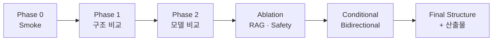

---

## 세 개의 숫자

| | 숫자 | 뜻 |
|--|------|----|
| **구조 · Phase 1** | Three-Agent Safety **4.83** / Empathy **4.31** | CounselChat 29건 기준 Single·RAG·Two·Three 비교. Faith / Empathy / Safety에서 Three-Agent가 가장 효과적 (Runtime 72s). |
| **모델 · Phase 2** | `qwen2.5:7b` + three_agent **score 69.40** | 5모델 × 2구조. Multi-Agent는 전반적으로 Empathy·Safety 향상 경향. 14b가 7b를 이기지 못함. |
| **조건부 · Final** | Revision **~6%** · Runtime **15.6s** (발표 표) / **45.6s** (재현 실험) | 항상 Rewrite 하지 않고, Gatekeeper가 문제일 때만 Revision. Safety↑ · Runtime↓ · parse 안정. |

---

## 왜 이 문제인가

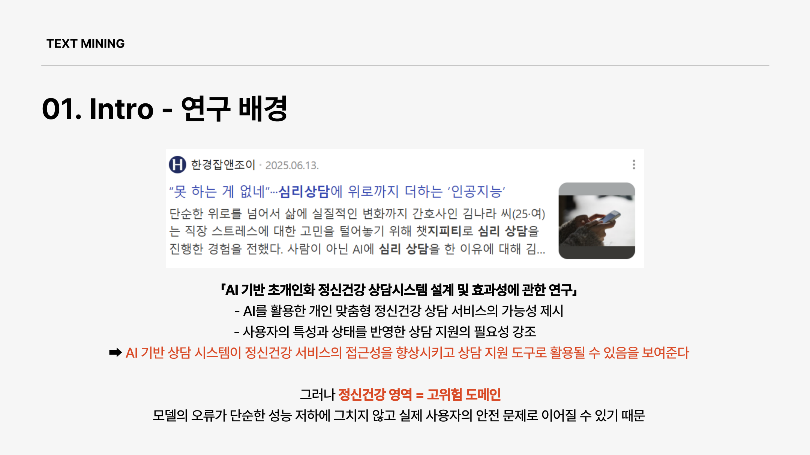

정신건강은 AI가 접근성을 높일 수 있는 영역이지만, **고위험 도메인**입니다. 모델 오판은 “틀린 답”이 아니라 **사용자 안전 이슈**가 됩니다.

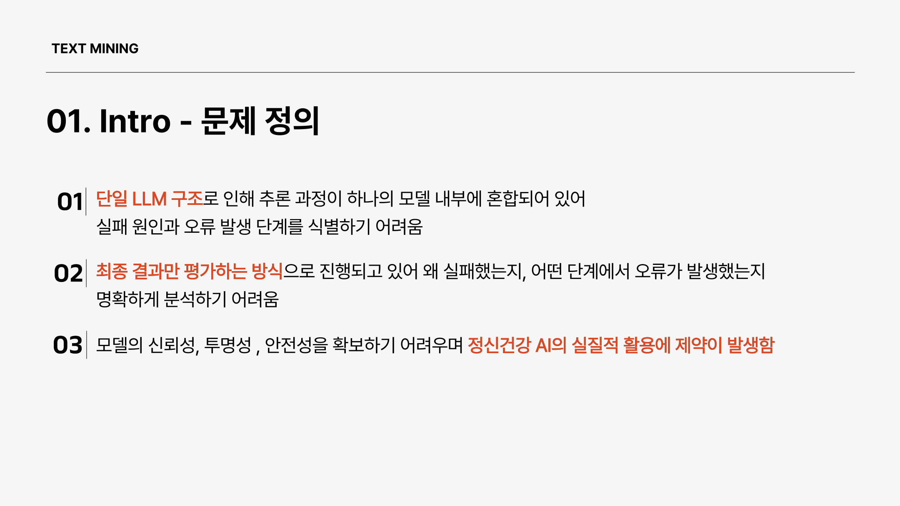

기존 Single LLM은 추론이 한 덩어리라 **실패 지점을 못 찾고**, 최종 점수만 보는 평가는 **왜 틀렸는지**를 못 말합니다. 그 결과 신뢰·투명·안전이 부족해 실사용이 막힙니다.

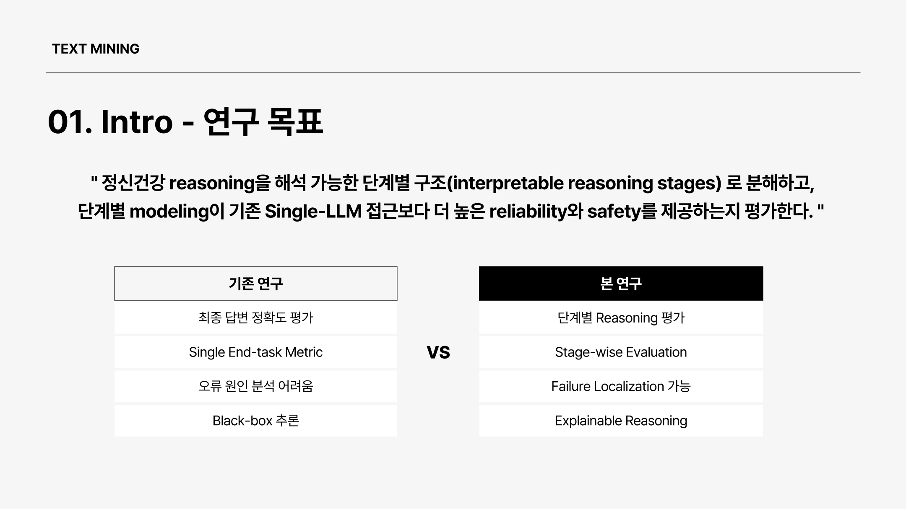

본 연구는 정신건강 reasoning을 **해석 가능한 단계**로 쪼개고, stage-wise modeling이 Single-LLM보다 reliability · safety를 주는지 평가합니다.

---

## 실험 흐름 — 6막

### 1막 — 구조를 먼저 고정한다 (Phase 1)

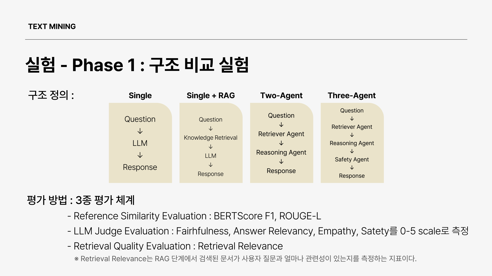

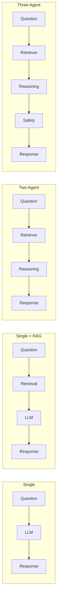

| 구조 | 흐름 |
|------|------|
| Single | Question → LLM → Response |
| Single + RAG | Question → Retrieval → LLM → Response |
| Two-Agent | Retriever → Reasoning → Response |
| Three-Agent | Retriever → Reasoning → **Safety** → Response |

모델은 `qwen2.5:7b` 하나로 고정해 **구조 효과만** 봅니다. KB는 NIMH / WHO 공식 문서, 데이터는 CounselChat 29건.

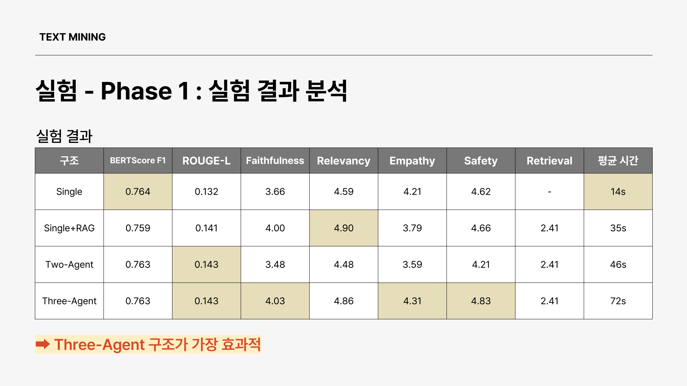

| 구조 | Faith | Relev | Empathy | Safety | 시간 |
|------|-------|-------|---------|--------|------|
| Single | 3.66 | 4.59 | 4.21 | 4.62 | **14s** |
| Single+RAG | 4.00 | **4.90** | 3.79 | 4.66 | 35s |
| Two-Agent | 3.48 | 4.48 | 3.59 | 4.21 | 46s |
| **Three-Agent** | **4.03** | 4.86 | **4.31** | **4.83** | 72s |

→ **Three-Agent가 가장 효과적.** 다만 시간이 가장 깁니다.

### 2막 — 평가지표를 고른다

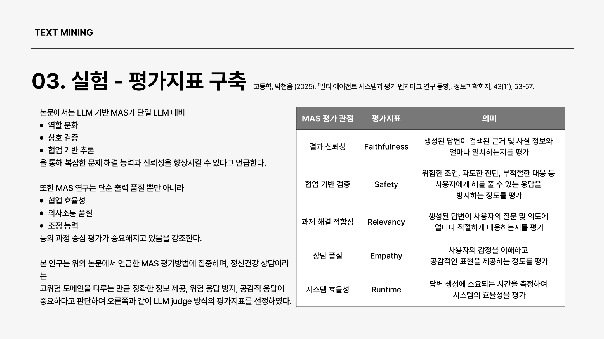

| 관점 | 지표 | 의미 |
|------|------|------|
| 결과 신뢰성 | Faithfulness | 근거·사실과의 일치 |
| 협업 검증 | Safety | 위험 조언·과도한 진단 방지 |
| 과제 적합성 | Relevancy | 질문 의도 부합 |
| 상담 품질 | Empathy | 정서 공감 |
| 시스템 효율 | Runtime | 응답 생성 시간 |

참고 유사도(BERTScore / ROUGE)만으로는 상담 품질을 못 가르므로, **LLM Judge 0–5** 를 병행합니다.

### 3막 — 모델이 바뀌어도 Multi-Agent 효과가 남는가 (Phase 2)

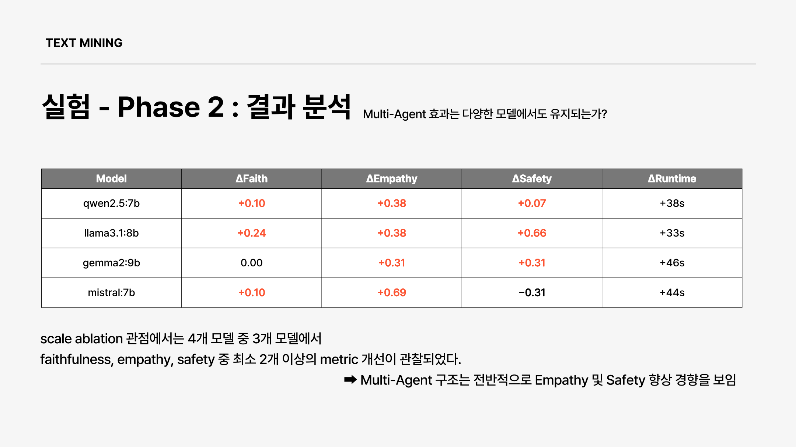

| Model | ΔFaith | ΔEmpathy | ΔSafety | ΔRuntime |
|-------|--------|----------|---------|----------|
| qwen2.5:7b | +0.10 | +0.38 | +0.07 | +38s |
| llama3.1:8b | +0.24 | +0.38 | +0.66 | +33s |
| gemma2:9b | 0.00 | +0.31 | +0.31 | +46s |
| mistral:7b | +0.10 | +0.69 | −0.31 | +44s |

→ 4모델 중 3모델이 Faith/Empathy/Safety 중 **2개 이상** 개선. **Empathy·Safety 향상 경향**.

Best overall (Phase 2 weighted): **`qwen2.5:7b` + `three_agent`**. Best speed: `llama3.1:8b` + `single_rag`.

### 4막 — 무엇이 성능을 올렸나 (Ablation)

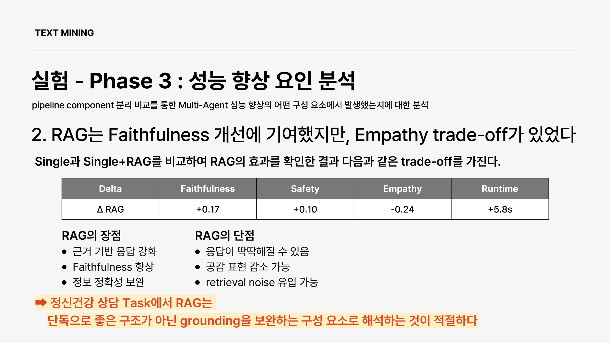

RAG는 Faithfulness **+0.17**, Safety **+0.10** 이지만 Empathy **−0.24**.  
→ RAG는 만능이 아니라 **grounding 보완 부품**.

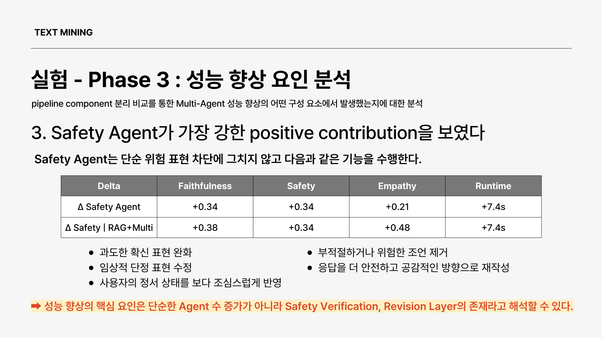

Δ Safety Agent: Faith **+0.34** · Safety **+0.34** · Empathy **+0.21**.

> 성능 향상의 핵심은 Agent 수 자체가 아니라 **Safety Verification · Revision Layer** 이다.

### 5막 — Conditional Bidirectional 로 최종 구조를 고정한다

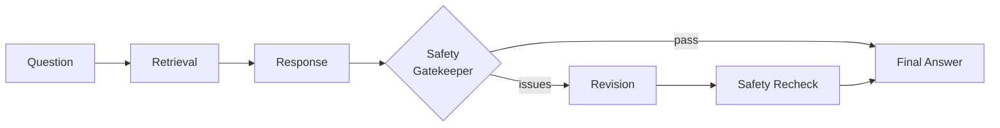

문제 있을 때만 Revision → Recheck. pass면 초안이 곧 최종입니다.

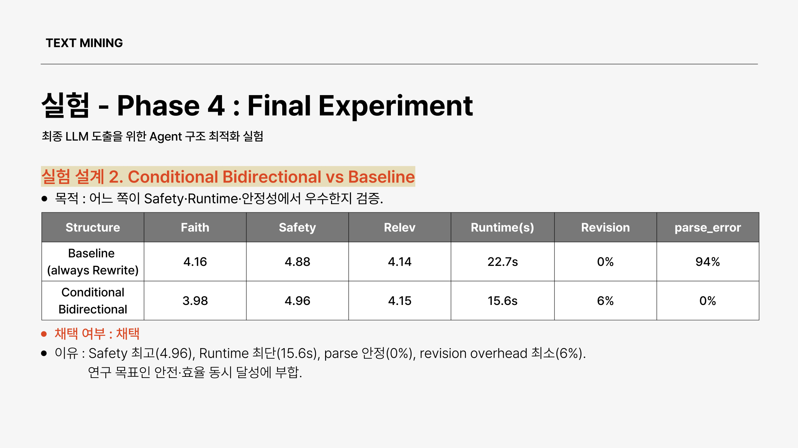

| 구조 | Faith | Safety | Runtime | Revision | parse_error |
|------|-------|--------|---------|----------|-------------|
| Baseline (always Rewrite) | 4.16 | 4.88 | 22.7s | 0%* | 94% |
| **Conditional Bidirectional** | 3.98 | **4.96** | **15.6s** | **6%** | **0%** |

\* always Rewrite는 “내용 수정 비율”이 아니라 **항상 재작성 경로**를 탄 구조. Conditional은 **필요할 때만** Revision.

채택 이유: **최고 Safety · 짧은 Runtime · 안정적 파싱 · 최소 Revision overhead.**

동일 데이터로 재현한 실험(`run_conditional_experiment.py`)에서는 Gatekeeper pass **~97%**, Revision **~3%**, avg runtime **45.6s** (three_agent 72.5s 대비 단축). 발표 표와 수치 스케일은 실험 설정(프롬프트/게이트)에 따라 달라질 수 있으나 **방향은 동일**합니다.

### 6막 — 중·고위험에서 효과가 보인다

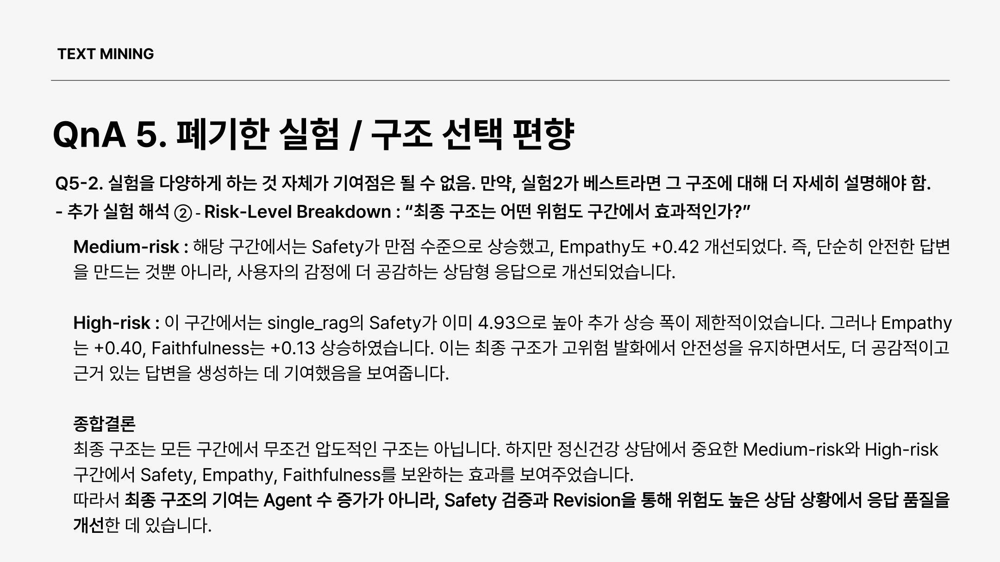

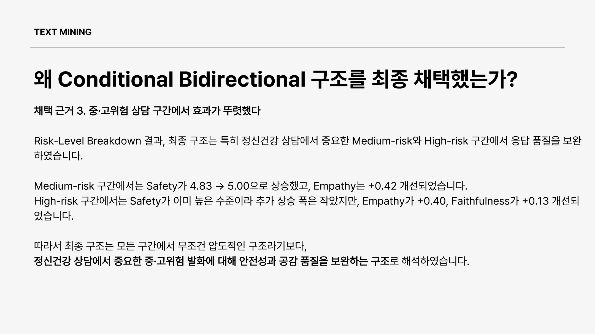

| 구간 | 관찰 |
|------|------|
| **Medium-risk** | Safety 4.83 → **5.00**, Empathy **+0.42** |
| **High-risk** | Safety는 이미 높아 Δ 작음, Empathy **+0.40**, Faith **+0.13** |

→ “모든 구간 압도”가 아니라, **도메인상 중요한 중·고위험 발화에서 Safety·Empathy를 보완**하는 구조입니다.

---

## Latency vs Safety — 서비스 관점

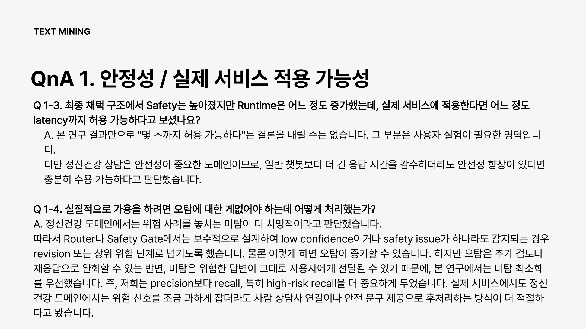

- 정신건강은 **안전이 최우선**이므로, Safety가 유의미하게 오르면 Latency 증가는 허용 가능하다고 판단했습니다.
- Router / Safety Gate는 **보수적**으로 설계합니다. 미탐(고위험 누락)이 오탐보다 치명적이므로 **Recall(고위험)을 Precision보다 우선**합니다.

---

## 구조 (코드)

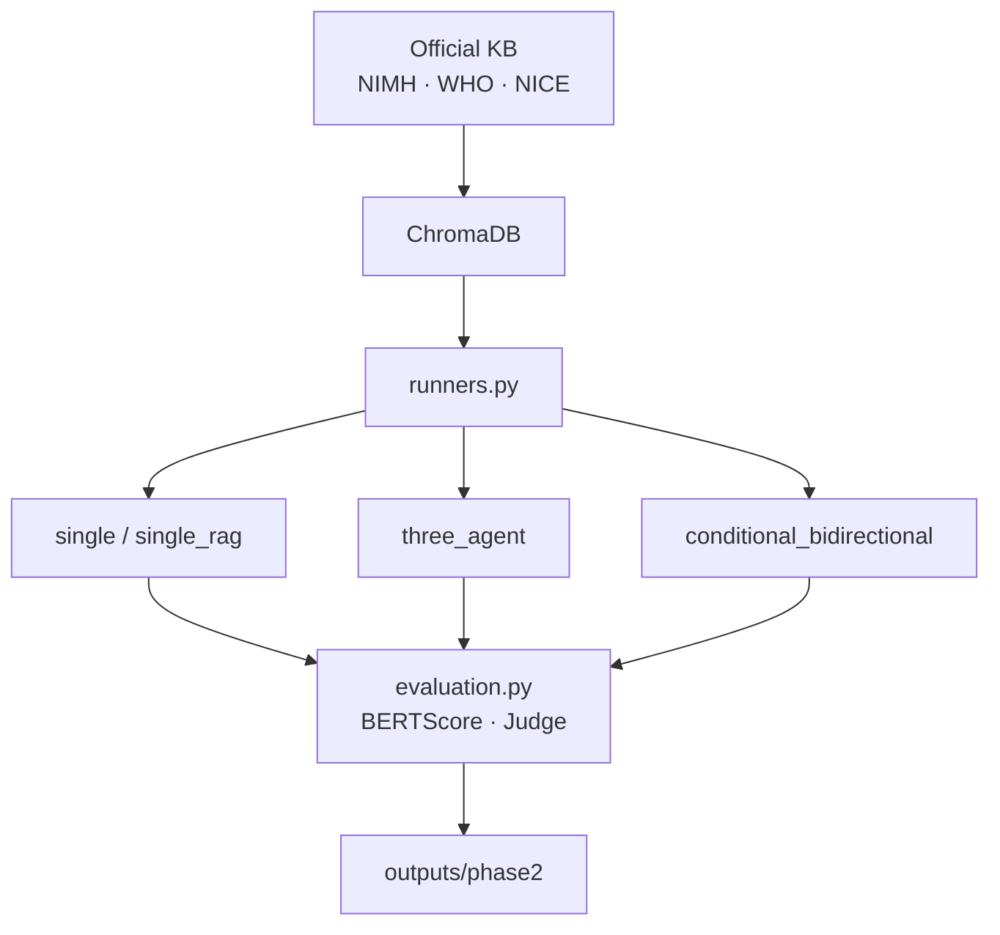

```
mental_health_agents/
  src/
    agents.py / prompts.py     # Symptom · Risk · Safety · Consensus (Phase 1계열)
    pilot/runners.py           # single / single_rag / two_agent / three_agent
                               # + conditional_bidirectional (Gatekeeper→Revision→Recheck)
    pilot/evaluation.py        # BERTScore · ROUGE · LLM Judge · Retrieval Judge
    phase2_runner.py           # CounselChat 모델 비교
    rag.py / knowledge_*       # 공식 KB → Chroma
  scripts/
    run_phases.py
    run_phase2.py
    run_conditional_experiment.py
    run_revision_analysis.py   # Draft vs Final / Trigger / Risk breakdown
    fetch_official_knowledge.py
    build_knowledge_db.py
  outputs/
    phase2/summary.md
    phase2/revision_analysis/
    phase2/conditional_experiment/
  data/knowledge/official/     # NIMH · WHO · NICE
```

JSON은 사용자에게 보여 주는 최종 답변이 아닙니다. Agent 간 필드(`revisions_made`, `safety_notes`, gatekeeper issues)를 넘기고 자동 평가하기 위한 **내부 표현**이며, 서비스·시연의 최종 출력은 **자연어 `response`** 입니다.

---

## 보장하지 않는 것 / 한계

| 한계 | 영향 |
|------|------|
| CounselChat n≈29–30 | 통계적 power 제한 |
| LLM Judge 동일 모델 | 상대 비교 중심으로 해석 |
| qwen2.5:7b JSON 불안정 | 품질은 높아도 파이프라인 안정성은 낮을 수 있음 |
| Conditional의 Gatekeeper는 항상 호출 | “연산 완전 스킵”이 아니라 **Revision/Recheck만 조건부** |
| 임상 ground truth 없음 | 연구용 Judge / pseudo-label |

만들지 않은 것: 로그인·실채널 발송·임상 배포 UI, 무응답 자동 승인.

---

## 문서

| 문서 | 내용 |
|------|------|
| `PROJECT_OVERVIEW.md` | 전체 아키텍처·Phase 요약 |
| `TEAM_EXECUTION_GUIDE.md` | 역할별 실행 가이드 |
| `mental_health_agents/outputs/phase2/summary.md` | Phase 2 모델 비교 표 |
| `mental_health_agents/outputs/phase2/conditional_experiment/` | Conditional 재실험 |
| `mental_health_agents/outputs/phase2/revision_analysis/` | Revision Contribution · Trigger · Risk |
| `docs/readme_assets/` | 발표 슬라이드 발췌 PNG |

---

## About

정신건강 상담에서 **Single vs Multi-Agent vs Conditional Safety Revision** 을 같은 평가축으로 비교하고,  
“Agent를 늘리는 것”이 아니라 **필요할 때만 고치는 Safety Layer** 가 성능의 핵심임을 실험으로 보인 프로젝트입니다.
